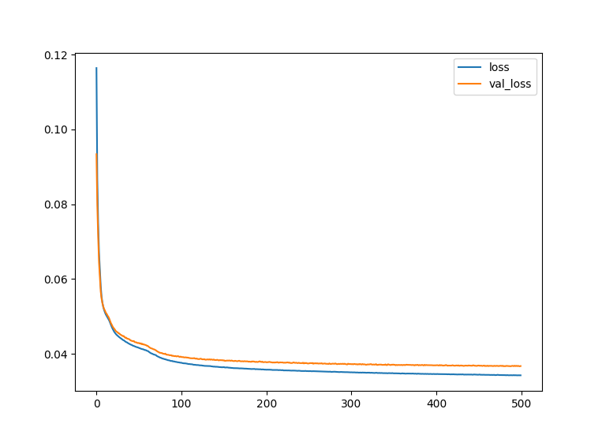
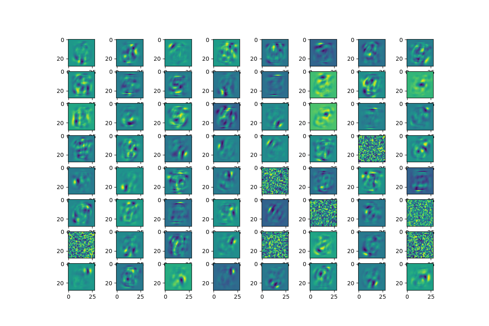

# Auto Encoder
This repository is an implementation of Auto Encoder in tensorflow.keras.
The different point of this repository is its compatibility with recommender systems that there are contains no_data_values in the input data and these data should not be involved in model training. Therefore, a BooleanMask layer is placed so that in each sample, the output value can be converted to no_data_value in places where the input sample is equal to no_data_value.

#### Auto Encoder Structure


## Getting started

### Requirements
- python 3.9
- Tensorflow == 2.11.0
- torch == 1.13.1
- pandas == 1.5.3
- numpy == 1.24.2
- mlxtend == 0.21.0
- sklearn~=0.0
- matplotlib == 3.6.3
- keras~=2.11.0
- scikit-learn~=1.1.1


### Usage
```python
from keras.optimizers import Adam
from AutoEncoder import AutoEncoder
from Utils import custom_mse_loss

auto_encoder = AutoEncoder(encoder_dims=[64, 32, 16])

auto_encoder.build_model(input_shape=(m, ), no_data_value=0)

auto_encoder.summary()

optimizer = Adam(learning_rate=0.001)

auto_encoder.compile(loss=custom_mse_loss, optimizer=optimizer)

auto_encoder.fit(training_set, training_set, epochs=100, batch_size=128, validation_data=(test_set, test_set),
                 workers=8)

pred = auto_encoder.predict(test_set)
```

### Visualize loss curves

```python
import pandas as pd
pd.DataFrame(auto_encoder.history.history).plot()
plt.show()
```

#### Loss curves for minist dataset reconstruction using RBM



### Visualize reconstructed images
```python
import matplotlib.pyplot as plt

plt.figure(figsize=(12, 8))
for i in range(1, 33):
    plt.subplot(8, 8, i * 2 - 1)
    plt.imshow(pred[i].reshape(28, 28))
    plt.subplot(8, 8, i * 2)
    plt.imshow(test_set[i].reshape(28, 28))

plt.show()
```

#### Reconstruction example of minist dataset


### Visualize weights
```python
import matplotlib.pyplot as plt

plt.figure(figsize=(12, 8))
for i in range(1, 65):
    plt.subplot(8, 8, i)
    plt.imshow(auto_encoder.model.weights[-2][i-1, :].numpy().reshape(28, 28))

plt.show()
```

#### Example weights for minist dataset 


## License
This repository is released under [Apache License V2](http://www.apache.org/licenses/LICENSE-2.0). To develop, publication and use it, please follow the terms of this license. 
